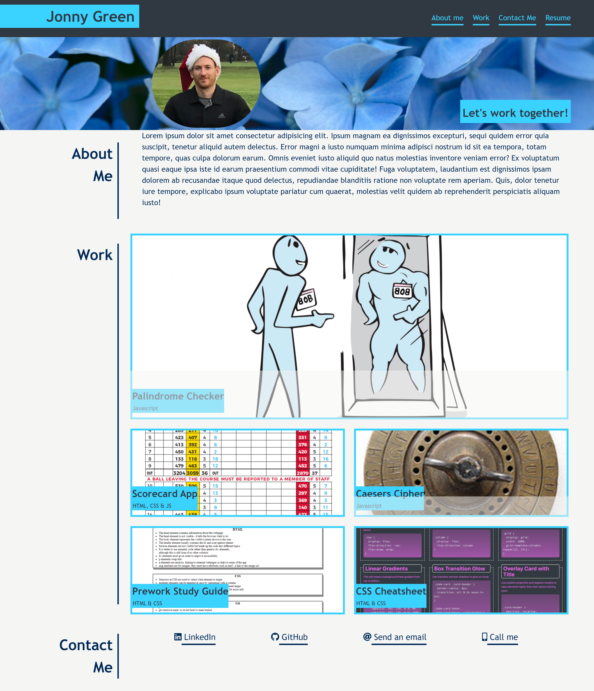

# Jonny Green - Personal Portfolio

## Description

This is a portfolio, designed to showcase my skills and talents as a developer by acting as a landing page with links to projects that I have worked on and links to ways to get in touch with me. This portfolio will be added to throughout the bootcamp course, eventually acting as a resume of sorts when I begin interviewing. 


## Table of Contents ()

- [Installation](#installation)
- [Usage](#usage)
- [Credits](#credits)
- [License](#license)

## Installation

No Installation necessary. 

## Usage
Use as a standard landing page.
All links will open in new tabs. Any inclomplete links will instead link to ```google.com. ```

    
    

Link to [Live-Page](https://jxg052.github.io/Jon-Green-Portfolio/)
   

## Credits

Thanks to edx bootcamp team for providing starter code and mockup. 

## License

MIT License

Copyright (c) 2022 JXG052
